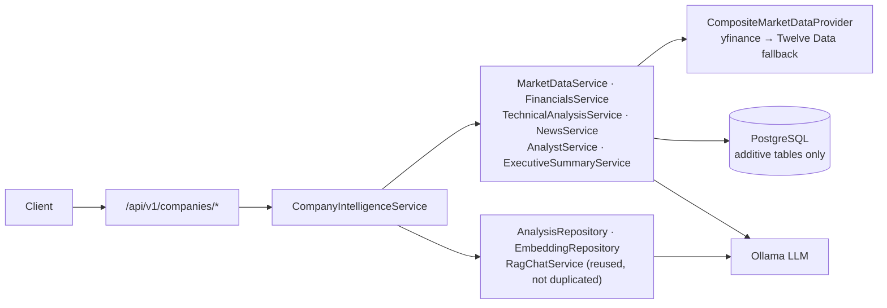

# MW StockMarket Analytics

**AI Stock Market Video Intelligence Platform**

Automatically discovers, transcribes, and analyzes financial commentary from YouTube
channels, extracting investment theses, sentiment, company/ticker mentions, key numbers,
and actionable insights — searchable via structured filters, pgvector semantic search,
and a RAG-powered chat assistant. On top of that, a **Company Intelligence module** turns
any ticker, company name, or keyword into a full research page: live market data,
fundamentals, technicals, news, analyst opinion, and an AI executive summary, all fully
integrated with the video pipeline above rather than duplicating it.

Runs entirely on free-tier infrastructure — **no OpenAI key required**: Groq (free
Whisper transcription) + Ollama (free local/Colab-GPU LLM + embeddings) + yfinance (free
market data).

Built as a **single-user personal tool** — there's no login screen or multi-tenant
auth. A default user is seeded at first migration and the whole app operates as them;
only the admin/scheduler routes are gated, behind a static `X-Admin-Key` header rather
than a session.

## Current status

**Full stack is functional end-to-end.** The video pipeline (discovery → transcription →
8 parallel LLM extractors → embedding → indexing) runs, is searchable, and is chat-able.
The Company Intelligence module's first three phases are built and verified live against
real tickers on both US (NASDAQ) and Indian (NSE/BSE) exchanges. A Next.js frontend
covers all of it — dashboard, company research pages with a real candlestick chart,
structured + semantic search, video intelligence, admin/pipeline monitoring, and a RAG
chat UI.

| Area | Status |
|---|---|
| Video discovery, transcription, 8-extractor AI analysis, embeddings, semantic search, RAG chat | ✅ Working |
| Company Intelligence — Phase 1 (resolution, live quote, charts, profile, AI video intelligence) | ✅ Working |
| Company Intelligence — Phase 2 (ratios, financial statements, earnings, technical analysis) | ✅ Working |
| Company Intelligence — Phase 3 (news + AI sentiment scoring, analyst insights, AI executive summary) | ✅ Working |
| Company Intelligence — Phase 4 (SEC filings, social sentiment, competitor comparison) | ⏳ Scoped, not built |
| Frontend — Next.js app covering the full backend surface | ✅ Working |
| Multi-user auth | ➖ Not applicable — single-user personal tool by design |

## Architecture

Full design documentation lives in `docs/`:
- [01-architecture.md](docs/01-architecture.md) — system overview, components, data flow
- [02-folder-structure.md](docs/02-folder-structure.md) — monorepo layout
- [03-database-schema.md](docs/03-database-schema.md) — PostgreSQL + pgvector schema (video pipeline)
- [04-api-design.md](docs/04-api-design.md) — FastAPI REST API specification
- [05-worker-architecture.md](docs/05-worker-architecture.md) — Celery queues and pipeline
- [06-roadmap.md](docs/06-roadmap.md) — phased development plan
- [07-company-intelligence.md](docs/07-company-intelligence.md) — Company Intelligence module: architecture diagrams, DB schema, provider waterfall, API reference, caching strategy

For deep operational detail (known bugs and fixes, exact env vars, pipeline state machine,
Ollama/Colab setup), see [`SYSTEM-CONTEXT.md`](SYSTEM-CONTEXT.md) at the repo root — that
file is the authoritative day-to-day reference and is kept current across sessions.

### System overview

```
YouTube channels ──▶ Discovery/Polling ──▶ Transcription (captions → Groq Whisper)
                                                    │
                                                    ▼
                          8 parallel LLM extractors (Ollama mistral)
                     summary · thesis · entities · topics · sentiment
                          quotes · key numbers · actionable insights
                                                    │
                                                    ▼
                    Chunk + embed (Ollama nomic-embed-text) ──▶ pgvector
                                                    │
                                                    ▼
                 FastAPI: structured search · semantic search · RAG chat
                          · analytics · daily reports · Company Intelligence
```

### Company Intelligence module



See [docs/07-company-intelligence.md](docs/07-company-intelligence.md) for the full
component diagram, request-lifecycle sequence diagram, and entity-relationship diagram.

### Frontend

Next.js 16 (App Router) + React 19 + TypeScript + Tailwind CSS 4, talking to the FastAPI
backend via a thin typed client (`frontend/src/lib/api.ts`) and SWR for data fetching.

| Route | What it does |
|---|---|
| `/` | Dashboard — trending stocks, sector heatmap, daily AI report, recent videos, process-a-video form with live pipeline-status polling |
| `/company/[ticker]` | Full Company Intelligence page — quote, real OHLC candlestick + volume chart (`lightweight-charts`), profile, ratios, financials, earnings, technicals, news, analyst insights, AI executive summary, video intelligence (with semantic search), RAG chat |
| `/search` | Structured (SQL filter) and semantic (pgvector) search over the video index |
| `/analytics` | Trending tickers/sectors, sentiment timeseries, sector heatmap |
| `/videos` | Video list with pipeline-status/sentiment filters |
| `/watchlist` | Personal watchlists (no auth — single default user) |
| `/admin` | Pipeline health donut, failure retry table, scheduler jobs, Groq/Ollama quota usage, task logs |
| `/chat` | Standalone RAG chat, not scoped to a single ticker |

The `X-Admin-Key` header is only attached to the specific calls that need it
(`adminApi.*`, `videoApi.reprocess`, scheduler triggers) — not sent on every request.

## Quick Start (Development)

### Prerequisites
- Docker + Docker Compose
- Python 3.11+ (for local dev without Docker)
- A [Groq API key](https://console.groq.com) (free) for transcription
- Ollama running somewhere reachable — locally, in Docker, or via an ngrok tunnel to a
  Colab GPU notebook (see `SYSTEM-CONTEXT.md` → "Ollama / Colab GPU" for the exact setup)

### 1. Clone and configure

```bash
git clone <repo-url> mw-stockmarket-analytics
cd mw-stockmarket-analytics/backend
cp .env.example .env
```

Edit `.env` — the values that actually matter for a working local setup:

```ini
SECRET_KEY=<openssl rand -hex 32>
ADMIN_API_KEY=changeme-admin-key

GROQ_API_KEY=<your free Groq key>          # transcription
LLM_PROVIDER=ollama
OLLAMA_BASE_URL=http://ollama:11434        # or your ngrok/Colab tunnel URL
OLLAMA_LLM_MODEL=mistral:latest
OLLAMA_EMBEDDING_MODEL=nomic-embed-text:latest

YOUTUBE_API_KEY=                            # optional — only needed for channel polling,
                                             # NOT for the single-video process-url endpoint
TWELVE_DATA_API_KEY=                        # optional — Company Intelligence market-data
                                             # fallback; empty means yfinance-only, which
                                             # is sufficient on its own
```

### 2. Boot via Docker Compose

```bash
cd ../infra
docker compose up -d
```

This starts:
- **postgres** (`localhost:5432`) — Postgres 16 + pgvector
- **redis** (`localhost:6379`) — Redis 7
- **ollama** (`localhost:11434`) — local Ollama fallback (skip if using a Colab tunnel)
- **api** (`localhost:8000`) — FastAPI backend
- **worker-discovery** — Celery worker (discovery, maintenance, **market_data** queues)
- **worker-transcription** — Celery worker (transcription queue, `--pool=solo`)
- **worker-analysis** — Celery worker (analysis, embedding queues, `--pool=solo`)
- **worker-reports** — Celery worker (reports queue)
- **beat** — Celery Beat scheduler

### 3. Run migrations

```bash
docker compose exec api alembic upgrade head
```

Current head: `0007` (video pipeline schema `0001`-`0003`, Company Intelligence Phases
1-3 add `0004`-`0006`, `0007` seeds the single default user this personal tool runs as).

### 4. Verify

```bash
curl http://localhost:8000/health
# Expected: {"status":"healthy","environment":"development"}
```

Access interactive API docs at: http://localhost:8000/api/docs

### 5. Run the frontend

```bash
cd ../frontend
npm install
```

Create `frontend/.env.local`:

```ini
NEXT_PUBLIC_API_URL=http://localhost:8000/api/v1
NEXT_PUBLIC_ADMIN_KEY=changeme-admin-key   # must match backend ADMIN_API_KEY
```

```bash
npm run dev
```

Open http://localhost:3000.

### 6. Try it

```bash
# Process a single YouTube video (no YouTube API key needed)
curl -X POST "http://localhost:8000/api/v1/videos/process-url?url=https://youtu.be/<video_id>"

# Once indexed, ask about a company mentioned in it — or any ticker at all
curl "http://localhost:8000/api/v1/companies/AAPL"
curl "http://localhost:8000/api/v1/companies/AAPL/executive-summary"
```

Or just paste the video URL into the dashboard's "Process YouTube Video" box — the UI
polls pipeline status for you and shows progress live.

## Development Workflow

### Running locally (without Docker)

1. Install dependencies:
   ```bash
   cd backend
   pip install -e .
   ```

2. Start Postgres+Redis via Docker Compose (just the infra):
   ```bash
   cd ../infra
   docker compose up postgres redis -d
   ```

3. Run migrations:
   ```bash
   cd ../backend
   alembic upgrade head
   ```

4. Start the API:
   ```bash
   uvicorn app.main:app --reload
   ```

5. Start Celery workers + beat (separate terminals — note `--pool=solo` for
   transcription/analysis, required for the libraries those queues use):
   ```bash
   celery -A app.core.celery_app worker -Q discovery,maintenance,market_data --concurrency=8 --loglevel=info
   celery -A app.core.celery_app worker -Q transcription --pool=solo --loglevel=info
   celery -A app.core.celery_app worker -Q analysis,embedding --pool=solo --loglevel=info
   celery -A app.core.celery_app worker -Q reports --loglevel=info
   celery -A app.core.celery_app beat --loglevel=info
   ```

**After code changes to workers** (not hot-reloaded — restart to pick up changes):
```bash
docker restart mw_worker_analysis mw_worker_transcription mw_worker_discovery
```

**After code changes to the API** — uvicorn's `--reload` usually picks it up, but on
Windows-mounted Docker volumes it can miss changes; if in doubt, `docker restart mw_api`.

### Linting / Type-checking / Tests

```bash
cd backend
ruff check .
mypy app
pytest
```

## Project Structure

```
backend/
├── app/
│   ├── main.py              # FastAPI app factory
│   ├── core/                # Config, logging, security, Celery app
│   ├── db/                  # SQLAlchemy base, session, migrations/ (0001-0007)
│   ├── models/               # ORM models — video pipeline + market_data.py,
│   │                         # financials.py, news_analyst.py (Company Intelligence)
│   ├── schemas/              # Pydantic request/response schemas
│   ├── repositories/         # Data access layer
│   ├── services/             # Business logic — analysis/embedding/search/rag_chat
│   │                         # + market_data/financials/technical_analysis/news/
│   │                         #   analyst/executive_summary/company_intelligence services
│   ├── providers/
│   │   ├── llm/               # Ollama, OpenAI adapters
│   │   ├── transcription/     # Groq, Whisper local/API, YouTube captions
│   │   ├── video_platforms/   # yt-dlp, YouTube Data API
│   │   └── market_data/       # yfinance (primary), Twelve Data (fallback), composite waterfall
│   ├── workers/tasks/        # Celery tasks, incl. market_data_tasks.py
│   ├── prompts/              # LLM prompt templates, incl. news_classification.py,
│   │                         #   company_executive_summary.py
│   ├── api/v1/routers/       # FastAPI route handlers, incl. company_intelligence.py
│   └── utils/                # Helpers (chunking, etc.)
├── tests/
├── alembic.ini
├── pyproject.toml
├── Dockerfile              # API image
└── Dockerfile.worker       # Worker image (heavier deps: ffmpeg, Whisper, yfinance)

frontend/
├── src/
│   ├── app/                  # Next.js App Router pages — dashboard, company/[ticker],
│   │                         #   search, analytics, videos, watchlist, admin, chat, channels
│   ├── components/
│   │   ├── charts/            # CandlestickChart (lightweight-charts)
│   │   ├── layout/             # Header, Sidebar
│   │   └── ui/                 # Badge, Skeleton, Tabs, ErrorState, MetricCard
│   └── lib/                  # api.ts (typed fetch client), hooks.ts (SWR hooks), utils.ts
├── package.json
└── tsconfig.json

infra/
└── docker-compose.yml      # Full stack orchestration

docs/
├── 01-architecture.md
├── 02-folder-structure.md
├── 03-database-schema.md
├── 04-api-design.md
├── 05-worker-architecture.md
├── 06-roadmap.md
└── 07-company-intelligence.md
```

## API Endpoints

Base URL: `http://localhost:8000` · Interactive docs: `/api/docs` · Admin/scheduler
routes require header `X-Admin-Key`; everything else is open — this is a single-user
personal tool, not a multi-tenant service.

### Video pipeline
| Method | Path | Notes |
|---|---|---|
| POST | `/api/v1/videos/process-url?url=` | Main entry point — no API key needed, uses yt-dlp |
| GET | `/api/v1/videos` | Filters: `channel_id`, `pipeline_status`, `content_type`, `sentiment` (`bullish\|bearish\|neutral`), `external_video_id` (poll a just-submitted video), `date_from`/`date_to`, `sort` |
| GET | `/api/v1/videos/{id}` | Pipeline status |
| POST | `/api/v1/videos/{id}/reprocess?from_stage=` | Admin retry — requires `X-Admin-Key` |
| GET | `/api/v1/videos/{id}/{summary\|sentiment\|companies\|key-numbers\|insights\|quotes\|transcript}` | Per-video AI results |
| GET | `/api/v1/search` | Structured filter search — `q`, `ticker`, `company`, `channel_id`, `creator` (channel name), `topic`, `date_from`/`date_to` |
| POST | `/api/v1/search/semantic` | pgvector semantic search |
| POST | `/api/v1/chat/sessions` · `/messages` | RAG chat |
| GET | `/api/v1/analytics/{trending-stocks\|trending-sectors\|sector-heatmap\|sentiment\|creator}` | Aggregations |
| GET/POST/DELETE | `/api/v1/watchlists`, `/watchlists/{id}/items`, `/watchlists/{id}/feed`, `/bookmarks` | Single-user watchlists/bookmarks — no auth |

### Company Intelligence
| Method | Path | Phase |
|---|---|---|
| GET | `/api/v1/companies/resolve?q=` | 1 |
| GET | `/api/v1/companies/{ticker}` | 1 |
| GET | `/api/v1/companies/{ticker}/{quote\|chart\|profile}` | 1 |
| GET | `/api/v1/companies/{ticker}/{ratios\|financials\|earnings\|technicals}` | 2 |
| GET | `/api/v1/companies/{ticker}/{news\|analyst\|executive-summary}` | 3 |
| GET | `/api/v1/companies/{ticker}/{videos\|intelligence}` | 1 (reused pipeline) |
| POST | `/api/v1/companies/{ticker}/chat` | 1 (reused pipeline) |

Full endpoint-by-endpoint reference with parameters: [docs/07-company-intelligence.md §7](docs/07-company-intelligence.md#7-api-reference).

### Admin
`/api/v1/admin/{pipeline/status\|pipeline/failures\|pipeline/retry\|quota\|task-logs}`,
`/api/v1/scheduler/jobs` — all require `X-Admin-Key`. `/admin/quota` reports real Groq
transcription and Ollama LLM/embedding usage against configurable daily limits, plus
videos processed in the last 7 days.

## Pipeline state machine

```
DISCOVERED → TRANSCRIPT_PENDING → TRANSCRIPT_READY → ANALYSIS_PENDING
          → ANALYZED → EMBEDDING_PENDING → EMBEDDED → INDEXED
          → FAILED (at any stage, auto-retried by Celery Beat every 10 min)
```

## Roadmap

- ✅ **Foundations** — repo scaffold, Docker Compose, DB schema, `/health` endpoint
- ✅ **Video pipeline** — discovery, transcription, 8-extractor AI analysis, embeddings, semantic search, RAG chat
- ✅ **Company Intelligence Phase 1** — ticker/company resolution, live market data, charts, profile, AI video intelligence integration
- ✅ **Company Intelligence Phase 2** — financial statements, ratios, earnings, in-house technical analysis
- ✅ **Company Intelligence Phase 3** — news aggregation with AI sentiment/impact scoring, analyst insights, AI executive summary
- ✅ **Frontend** — Next.js app covering dashboard, company research (candlestick charts,
  semantic search), structured/semantic search, analytics, admin/pipeline monitoring, RAG chat
- ⏳ **Company Intelligence Phase 4** — SEC filings (US-only), social sentiment (Reddit + best-effort StockTwits), competitor comparison
- ⏳ **Additional video sources** — podcasts, Twitter/X (source-adapter pattern already anticipated in the architecture)
- ⏳ **Hardening** — broader test coverage, observability dashboards, production-grade docker-compose

See [docs/06-roadmap.md](docs/06-roadmap.md) for the original phased plan and
[docs/07-company-intelligence.md §10](docs/07-company-intelligence.md#10-whats-not-built--phase-4)
for exactly what Phase 4 would involve and why it's deferred.

## License

Proprietary / Internal use only.

## Contact

For questions or contributions, reach out to the MW StockMarket Analytics team.
