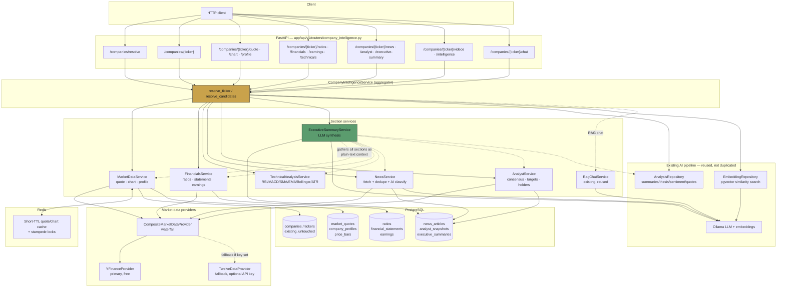
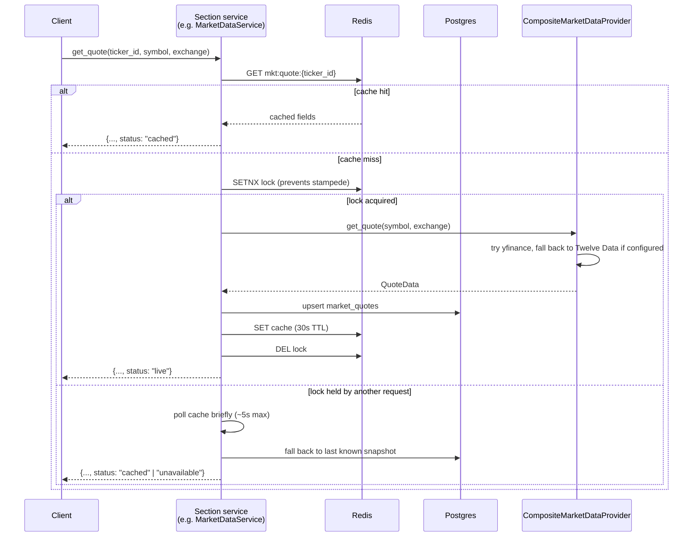
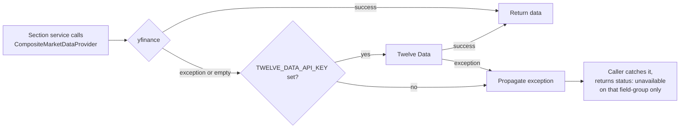

# Company Intelligence Module

Backend-only feature (no frontend work in this scope) that turns a bare ticker, company
name, or keyword into a full research page — live market data, fundamentals, technicals,
news, analyst opinion, and an AI executive summary — while fully reusing the existing
YouTube video-analysis pipeline instead of rebuilding it. Delivered in three phases, all
implemented and verified live against real tickers (AAPL/NASDAQ, RELIANCE/NSE). Phase 4
(SEC filings, social sentiment, competitor comparison) is scoped but not built.

## 1. Why this exists

The platform previously only surfaced stock data *indirectly*, through AI extraction
from video transcripts (`companies`, `tickers`, `key_numbers` — all keyed by `video_id`).
There was no way to ask "tell me about AAPL" directly: no ticker resolution, no live
price, no company-centric view. This module adds that entry point without touching the
video pipeline's schema — every new table is additive.

## 2. High-level architecture



## 3. Request lifecycle — cache-through pattern

Every live-data section (quote, ratios, statements, earnings, news, analyst) follows the
same three-layer pattern: Redis (hot path, quotes only) → Postgres durable snapshot →
provider waterfall. This is what makes every endpoint degrade gracefully instead of
throwing when yfinance is slow, rate-limited, or down.



The **AI executive summary** is the one section that inverts this — it doesn't call a
provider directly. `CompanyIntelligenceService.get_executive_summary()` calls its own
`get_overview` / `get_ratios` / `get_technicals` / `get_earnings` / `get_news` /
`get_analyst_insights` / `get_intelligence` methods (each independently cached per the
pattern above), turns each result into a short plain-text block, and hands the whole
context dict to `ExecutiveSummaryService`, which does one Ollama call and persists the
result with its own (shorter, 6h) freshness window.

## 4. Database schema (additive only)

No existing table (`companies`, `tickers`, `videos`, `video_companies`, …) was modified.
Every new table hangs off `companies.id` or `tickers.id`.

```mermaid
erDiagram
    companies ||--o| company_profiles : "1:1"
    companies ||--o{ news_articles : "1:many, deduped by url"
    companies ||--o{ financial_statements : "1:many, one row per period"
    tickers ||--o| market_quotes : "1:1, upserted"
    tickers ||--o{ price_bars : "1:many, daily interval only"
    tickers ||--o| ratios : "1:1"
    tickers ||--o| analyst_snapshots : "1:1"
    tickers ||--o| executive_summaries : "1:1"
    companies ||--o| earnings : "1:1"
    companies ||--o{ tickers : "existing FK, untouched"

    companies {
        bigint id PK
        text name
        text sector
        text industry
    }
    tickers {
        bigint id PK
        bigint company_id FK
        text symbol
        text exchange
    }
    company_profiles {
        bigint company_id PK_FK
        text description
        text ceo
        text headquarters
        date ipo_date
        jsonb business_segments
    }
    market_quotes {
        bigint ticker_id PK_FK
        numeric price
        numeric change_pct
        numeric market_cap
        numeric week52_high
        numeric week52_low
        timestamp fetched_at
    }
    price_bars {
        bigint id PK
        bigint ticker_id FK
        text interval "always 1d — see note below"
        timestamp ts
        numeric open_high_low_close
        bigint volume
    }
    ratios {
        bigint ticker_id PK_FK
        numeric pe_trailing
        numeric peg_ratio
        numeric roe
        numeric roic "derived, not from provider"
        numeric debt_to_equity
    }
    financial_statements {
        bigint id PK
        bigint company_id FK
        text statement_type "income|balance|cashflow"
        text period_type "annual|quarterly"
        date period_end
        jsonb line_items "curated subset, not full ~70-row dump"
    }
    earnings {
        bigint company_id PK_FK
        date next_earnings_date
        numeric eps_estimate_avg
        jsonb history "8 quarters of surprise %"
        text ai_summary "Ollama-generated"
    }
    news_articles {
        bigint id PK
        bigint company_id FK
        text title
        text url "unique per (company_id, url)"
        text sentiment "AI-classified, nullable until classified"
        numeric impact_score "AI-classified 0-100"
        jsonb related_tickers
    }
    analyst_snapshots {
        bigint ticker_id PK_FK
        text recommendation_key "e.g. buy, strong_buy"
        numeric target_mean
        jsonb recommendation_trend "4 months of buy/hold/sell counts"
        jsonb actions "upgrades/downgrades"
        jsonb institutional_holders
        jsonb insider_transactions
    }
    executive_summaries {
        bigint ticker_id PK_FK
        text investment_thesis
        jsonb positive_factors
        jsonb risks
        jsonb opportunities
        numeric confidence_score
    }
```

**Note on `price_bars`:** only the `1d` interval is persisted. A single daily refresh
fetches a 5-year span, which covers the 1M/3M/6M/1Y/5Y chart ranges by filtering on read
— no need to store a separate series per range. Intraday (1D/1W) and MAX are fetched live
with a short Redis cache instead of being persisted, since they're either too granular or
too rare to justify the row growth.

## 5. Provider waterfall



Twelve Data is unconfigured by default (`TWELVE_DATA_API_KEY=""`) — with no key, the
composite provider is a thin pass-through to yfinance alone. `TwelveDataProvider`
implements ratios/financials/earnings/news/analyst methods as honest
`raise ExternalServiceError(...)` stubs, since its free tier doesn't support fundamentals
at all — this keeps the class instantiable (required by the shared ABC) without
pretending to support data it can't actually serve.

## 6. Phase-by-phase breakdown

### Phase 1 — Foundation (spec sections 1, 2, 3, 10, 15, 16)

| Area | What was built |
|---|---|
| Resolution | `CompanyRepository` — matches by (symbol, exchange) first, not exact-name string matching (the video pipeline's known duplicate-company weakness), so this module doesn't inherit that bug |
| Live market data | `MarketDataService` — cache-through quote/chart/profile |
| Charts | 1D/1W/1M/3M/6M/1Y/5Y/MAX; only `1d` bars persisted (see §4 note) |
| AI video intelligence | `AnalysisRepository.get_video_ids_by_company()` pivots the *existing* per-video tables (summaries, thesis, sentiment, key numbers, quotes, insights) from "one video" to "every video mentioning this company" — zero duplication of the analysis pipeline |
| Ticker-scoped semantic search & chat | Extended `EmbeddingRepository.similarity_search()` and `RagChatService.answer()` with an optional `video_ids: list[int]` param (backward-compatible with the existing single-`video_id` callers) |
| Source attribution | Every field-group carries `source` / `fetched_at` / `status` (`live`\|`cached`\|`unavailable`) |

New files: `providers/market_data/{base,yfinance_provider,twelvedata_provider,composite_provider}.py`,
`models/market_data.py`, migration `0004`, `repositories/{company_repository,market_data_repository}.py`,
`services/{market_data_service,company_intelligence_service}.py`, `schemas/company_intelligence.py`,
`api/v1/routers/company_intelligence.py`, `workers/tasks/market_data_tasks.py`.

### Phase 2 — Fundamentals & technicals (spec sections 4, 5, 6, 11)

| Area | What was built |
|---|---|
| Ratios | Almost entirely sourced directly from yfinance's `.info` (P/E, PEG, P/B, EV/EBITDA, ROE, ROA, D/E, dividend yield, current/quick ratio, beta) |
| ROIC | The one ratio yfinance doesn't expose — derived in-house: `NOPAT / Invested Capital` from the latest annual EBIT/tax rate and most recent invested capital figure |
| Financial statements | Income/balance/cashflow, annual + quarterly, curated line-item subset (not yfinance's full ~40-70 row dump) |
| Earnings | Next date + consensus range from `.calendar`, 8 quarters of actual-vs-estimate history from `.get_earnings_dates()` (needs `lxml` — added as a dependency) |
| AI earnings summary | One Ollama call over the surprise history — reuses the same LLM infra as the video pipeline |
| Technical analysis | Computed **in-house** from Phase 1's persisted daily bars — RSI (Wilder-smoothed), MACD, SMA/EMA, Bollinger Bands, ATR, Stochastic RSI, support/resistance (20d/60d swing high-low), and a heuristic trend classification. No new dependency — pandas/numpy already ride in transitively via yfinance. Sub-10ms per request, so no caching layer needed. |

New files: `models/financials.py`, migration `0005`, `repositories/financials_repository.py`,
`services/{financials_service,technical_analysis_service}.py`.

### Phase 3 — News, analyst insights, AI executive summary (spec sections 7, 9, 14)

| Area | What was built |
|---|---|
| News | Fetched via yfinance, deduped by `(company_id, url)` at the DB layer (`ON CONFLICT DO NOTHING`), refreshed every 2h |
| AI classification | **One batched Ollama call** classifies sentiment/impact_score/related_tickers for all fetched articles at once — not one call per article, matching the platform's existing batching discipline (same principle as `embedding_service.py`) |
| Analyst insights | Consensus trend (4 months of buy/hold/sell counts), price targets, upgrades/downgrades, institutional holders, insider transactions — all from yfinance |
| AI executive summary | The capstone. `CompanyIntelligenceService.get_executive_summary()` gathers every other section (quote, profile, ratios, technicals, earnings, news, analyst, **and the platform's own AI video sentiment/thesis**), reduces each to a plain-text block, and hands it to `ExecutiveSummaryService` for one synthesis call. Verified to genuinely reconcile conflicting signals (e.g. RELIANCE: bearish technicals + bullish analyst consensus + bullish recent news → a coherent "oversold but well-positioned" thesis, citing real numbers, not fabricated ones) |

New files: `prompts/{news_classification,company_executive_summary}.py`, `models/news_analyst.py`,
migration `0006`, `repositories/{news_repository,analyst_repository,executive_summary_repository}.py`,
`services/{news_service,analyst_service,executive_summary_service}.py`.

## 7. API reference

All routes are under `/api/v1/companies`.

| Method | Path | Phase | Notes |
|---|---|---|---|
| GET | `/resolve?q=` | 1 | Ranked candidates for a ticker/name/keyword query |
| GET | `/{ticker}` | 1 | Main entry-point page: identity + quote + profile |
| GET | `/{ticker}/quote` | 1 | Live price, change, volume, market cap, 52w range |
| GET | `/{ticker}/chart?range=&interval=` | 1 | OHLCV bars |
| GET | `/{ticker}/profile` | 1 | Description, HQ, employees, website, IPO date |
| GET | `/{ticker}/ratios` | 2 | P/E, PEG, P/B, EV/EBITDA, ROE, ROA, ROIC, D/E, yield, beta |
| GET | `/{ticker}/financials?statement=&period=` | 2 | income\|balance\|cashflow × annual\|quarterly |
| GET | `/{ticker}/earnings` | 2 | Next date, estimates, 8Q surprise history, AI summary |
| GET | `/{ticker}/technicals` | 2 | RSI, MACD, SMA/EMA, Bollinger, ATR, Stochastic RSI, trend |
| GET | `/{ticker}/news?limit=` | 3 | Deduped articles with AI sentiment/impact/related tickers |
| GET | `/{ticker}/analyst` | 3 | Consensus, targets, upgrades/downgrades, holders |
| GET | `/{ticker}/executive-summary` | 3 | Full AI-synthesized briefing |
| GET | `/{ticker}/videos` | 1 | Videos mentioning this company (reused pipeline) |
| GET | `/{ticker}/intelligence?q=` | 1 | Full AI-video bundle + optional ticker-scoped semantic search |
| POST | `/{ticker}/chat` | 1 | RAG chat scoped to this company's videos |

## 8. Caching / freshness summary

| Data | Layer(s) | Freshness | Why |
|---|---|---|---|
| Live quote | Redis (30s) + Postgres | N/A (always try live first) | Hot path, avoids duplicate provider calls within seconds |
| Daily chart bars | Postgres only | Refreshed daily by Celery beat | Cheap, common ranges (1M-5Y) served from one series |
| Intraday/MAX chart | Redis (30s) | Live on every request past TTL | Too granular/rare to persist |
| Company profile | Postgres only | 7 days | Changes rarely |
| Ratios / financials / earnings / analyst | Postgres only | 20 hours | Daily-ish cadence; P/E depends on live price but doesn't need second-by-second accuracy |
| News | Postgres only | 2 hours | Time-sensitive, but not a hot path |
| Executive summary | Postgres only | 6 hours | Shorter than fundamentals — "why is it moving today" ages faster |
| Technicals | None (computed fresh) | N/A | Sub-10ms pure computation, no benefit to caching |

Scheduled Celery tasks (`workers/tasks/market_data_tasks.py`, `market_data` queue, run on
`worker-discovery`): `refresh_watched_quotes` (every 5 min), `refresh_daily_bars` (daily
01:00 UTC), `refresh_company_profiles` (weekly). All three scope to tickers in any user's
`WatchlistItem` — not every ticker ever mentioned by a video — so idle tickers aren't
needlessly refreshed.

## 9. Bugs found and fixed during this build

None of these were pre-existing — all surfaced and were fixed while building this module:

1. **Exchange-suffix matching** — `tickers.exchange` values populated by the *video*
   pipeline are sometimes combined strings like `"NSE|BSE"`. The Yahoo-suffix lookup did
   an exact match and silently fell through to treating the symbol as a bare US ticker.
   Fixed with substring matching (`"NSE" in exch`), prioritizing NSE.
2. **Timezone mismatch** — yfinance returns bar timestamps localized to the exchange's
   own timezone (e.g. `Asia/Kolkata` for NSE); this project's DB columns are naive UTC
   (a documented existing constraint — see `SYSTEM-CONTEXT.md` Bug 4). Fixed by converting
   to UTC and stripping tzinfo before persisting.
3. **`price_bars` unique-constraint name mismatch** — the migration's inline
   `UNIQUE(...)` got Postgres's auto-generated name, but the repository's
   `ON CONFLICT DO UPDATE` referenced the ORM model's explicit constraint name. Caught
   before it shipped by re-running the migration with a named constraint.
4. **`get_intelligence()` had no fault isolation** — an embedding-provider failure (e.g.
   an expired Colab Ollama tunnel) took down the *entire* response, including the
   AI-video bundle that has nothing to do with embeddings. Fixed by wrapping the semantic
   search sub-call so it degrades to `semantic_results: []` instead of a 502.
5. **Encapsulation slip** — `get_technicals()` originally reached into
   `market_data_service._repo` (a private attribute of another service). Fixed by
   instantiating `MarketDataRepository` directly instead.
6. **Missing `lxml` dependency** — `get_earnings_dates()` silently failed without it;
   added to `pyproject.toml` / both Dockerfiles.

## 10. What's not built — Phase 4

Deferred per the original phasing decision (best-effort + honest fallback for the two
weakest-coverage areas):

- **SEC/exchange filings** (spec §8) — SEC EDGAR is free and would cover US tickers
  (AAPL) but has no equivalent for NSE/BSE (RELIANCE). Would need a graceful
  "not available for this exchange" path for Indian tickers.
- **Social sentiment** (spec §12) — X/Twitter's API is paid-only now; StockTwits' public
  endpoint is unofficial and unreliable. Plan was Reddit (free via a registered app) +
  best-effort StockTwits, explicitly skipping X.
- **Competitor comparison** (spec §13) — would reuse the existing `companies.sector`
  column populated by the video pipeline to find peer candidates, falling back to
  explicit ticker lists for exact comparison.

## 11. Reused vs. new — the reuse map

The module's core design principle: extend the AI video pipeline, never duplicate it.

| Existing thing | How it's reused here |
|---|---|
| `companies` / `tickers` tables | Identity backbone for every new table — nothing new was invented for "what is a company" |
| `AnalysisRepository` | Powers `/videos` and `/intelligence` directly — same summaries/thesis/sentiment/quotes tables the video pipeline already writes |
| `EmbeddingRepository.similarity_search()` | Extended (not replaced) with a `video_ids` list filter for ticker-scoped semantic search |
| `RagChatService.answer()` | Same extension — ticker-scoped chat is the existing RAG service with a different video-set filter |
| Ollama LLM provider | Used for earnings AI summaries, news classification, and the executive summary — same free-LLM infra as video analysis, no new provider |
| `Watchlist` / `WatchlistItem` | Drives which tickers the Celery beat refresh tasks bother keeping warm |
| Provider waterfall pattern | Modeled directly on `transcript_service.py`'s existing YouTube-captions → Whisper fallback |
